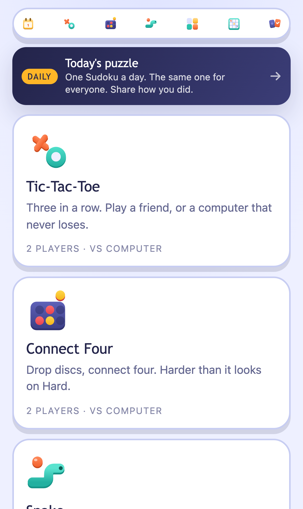
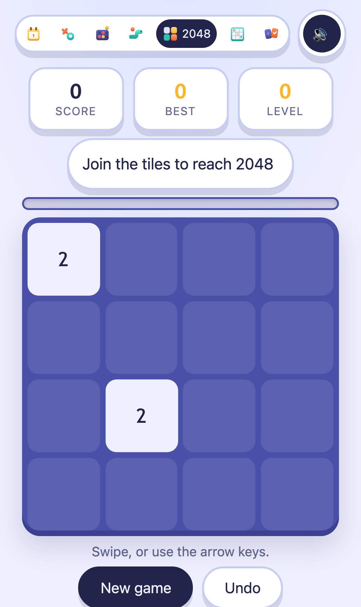
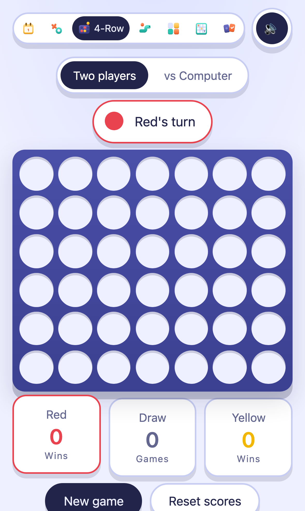

# adtech-lab

A small but real AdTech ecosystem, built to learn the industry by implementing
it: a publisher with real games, an ad server, a first-price auction, a mini DSP
across a network boundary, an OpenRTB 2.6 subset, and the supply-chain files
(`ads.txt`, `sellers.json`, `schain`) that tie them together. It runs on AWS for
about a dollar a month.

**Live: https://xoxoxo.live**

<p align="center">
  
  
  
  
</p>

## Why this exists

Terms like `eCPM`, `fill rate`, `bid floor`, `pacing`, `take rate` and `schain`
only feel natural once you have built and operated the thing they describe. So
this repository builds each one, small, and writes down what it taught.

```
1. Learn                    primary. Knowledge is the ROI.
2. Earn real money          secondary, and real -- not hypothetical.
3. Optimise and scale it    only once 1 and 2 exist.
```

That order decides every trade-off in the project.

## If you are here to learn

| Start with | What you get |
|---|---|
| [insights.md](docs/insights.md) | Every non-obvious finding, with its evidence |
| [learning-progress.md](docs/learning-progress.md) | What each phase taught, worked through |
| [money-flow.md](docs/money-flow.md) | One impression, one dollar, two ledgers |
| [reporting-discrepancy.md](docs/reporting-discrepancy.md) | Why two companies counting the same events disagree by 19% |
| [glossary.md](docs/glossary.md) | Terms, with the trade-off each one hides |
| [agent-fleet.md](docs/agent-fleet.md) | Nine agents that open pull requests and never merge them |

## Run it locally

Go 1.26+, Python 3 and Chrome are enough. No AWS account needed.

```bash
make test               # Go tests
make test-site          # browser assertions against the build, 3 viewports

make dsp                # the buyer, on :8081
make ad-server-local    # the seller, on :8090, lab mode
make discrepancy        # drive traffic through both and compare their numbers
```

## Deploy your own

Nothing that identifies an account is in this repository. Account id, CLI
profile, alert email and the GitHub OIDC ids are required values with no
defaults, so a copy cannot accidentally point at someone else's account.

1. Copy [`infrastructure/terraform.tfvars.example`](infrastructure/terraform.tfvars.example)
   into each stack as `terraform.tfvars` (gitignored) and fill it in.
2. Create `local.mk` (gitignored) with `AWS_PROFILE_NAME` and `AWS_ACCOUNT_ID`.
3. Apply the stacks in order: `guardrails` (budgets and anomaly alerts first),
   `ad-server`, `edge`, `cicd`.
4. Set the repository secrets `AWS_ACCOUNT_ID`, `AWS_DEPLOY_ROLE_ARN` and
   `AWS_REPORT_ROLE_ARN`. `TELEGRAM_BOT_TOKEN`, `TELEGRAM_CHAT_ID` and
   `ITCH_API_KEY` are optional; the agents stay quiet without them.
5. Replace the domain, `ads.txt`, `sellers.json` and the contact address in
   `apps/publisher` with your own.

Read the cost section of [CLAUDE.md](CLAUDE.md) and
[cost-model.md](docs/cost-model.md) before you apply anything: there is no hard
spending cap on AWS, only layered protection.

---

## Architecture

Deployed and serving. One CloudFront distribution, two origins, one domain — so
the Publisher and the ad server look like a single origin to the browser, which
is exactly how a real publisher's first-party ad endpoint behaves.

```text
                             BROWSER
                                │
                                ▼
                    ┌────────────────────────┐
                    │   CloudFront (us-east-1)│  xoxoxo.live, ACM TLS
                    │   + CloudFront Function │  /xo → /xo/index.html
                    └───────────┬─────────────┘
              static │                        │ dynamic (never cached)
        /  /xo  /connect-four                 │  POST /ad/request
        /privacy  /ads.txt  /static/*         │  GET  /event/impression
                    │                         │  GET  /event/click
                    ▼                         │  POST /collect
        ┌───────────────────────┐             ▼
        │  S3  (private, OAC)   │   ┌──────────────────────────┐
        │  the game room        │   │  API Gateway HTTP API    │ 20 rps/route
        └───────────────────────┘   │  per-route throttling    │
                                    └────────────┬─────────────┘
                                                 ▼
                                    ┌──────────────────────────┐
                                    │  Lambda: ad-server       │ Go, ARM64, 128MB
                                    │  eligibility → priority  │
                                    │  → expected_ecpm         │
                                    └────┬───────────┬─────────┘
                                         │           │
                          ┌──────────────┘           └──────────────┐
                          ▼                                         ▼
              ┌───────────────────────┐                 ┌───────────────────────┐
              │ DynamoDB              │                 │ S3: events/           │
              │  control plane        │                 │  gzipped NDJSON       │
              │   (cached 60s in mem) │                 │  dt=/hh= partitions   │
              │  serving_budget_state │                 └───────────┬───────────┘
              │   (atomic ADD, TTL)   │                             ▼
              └───────────────────────┘                 ┌───────────────────────┐
                                                        │ Athena + Glue         │
                                                        │  the billing ledger   │
                                                        │  1GB scan cutoff      │
                                                        └───────────────────────┘

     ── cost safety ────────────────────────────────────────────────────────────
     CloudWatch alarms (route-aware) ─→ SNS ─→ Lambda: cost-fuse
        AD FUSE        /ad/request, /event/*  → ad-server concurrency 0
        ANALYTICS FUSE /collect               → drops writes, ad serving UNAFFECTED
        static site is behind NEITHER: a traffic spike must never kill the games
     Budgets $20/40/60/80/100 · Cost Anomaly Detection (IMMEDIATE, ≥$5)
```

### Why these choices

| Decision | Reason |
|---|---|
| **Control plane cached in Lambda memory** (60s TTL) | A per-request DB lookup does not fit a p99 budget in tens of ms. Consequence: the hot path issues ~zero reads |
| **`serving_budget_state` ≠ `billing_ledger`** | Serving state may be approximate — bounded over-delivery is normal. The ledger is durable and idempotent. Merging them would be the most misleading simplification available |
| **API Gateway over Lambda Function URL** | Function URLs have no throttling, and a browser POST behind OAC must compute its own payload hash. Per-route throttling is a real cost control |
| **Events straight to S3, not Firehose** | Firehose is **unavailable on the AWS Free plan**. Same partition layout, so a future move to a managed pipeline changes no query |
| **Athena, not Prometheus, for business metrics** | `line_item × creative × placement × country × game × device` is unbounded cardinality. Real ad platforms query fill rate from the event log, not a TSDB. See [ADR 0002](docs/adr/0002-observability-without-a-metrics-stack.md) |
| **No WAF yet** | $7–8/month against a $0.51/month system. Added on real traffic or real abuse, not before |
| **No `www`** | The domain is new; nothing has ever linked to `www.xoxoxo.live`. A SAN, a DNS record and a redirect branch to prevent a broken link that cannot yet exist |
| **CloudFront rewrites 404 but never 403** | A 403 from the ad server means "this tracking token is forged". Rewriting it would hide the integrity check doing its job |

### Free-plan constraints discovered by deploying

Not in any architecture doc — found by applying:

```
Firehose                      unavailable     → S3 sink instead
route53domains                unavailable     → domain at GoDaddy
Lambda reserved concurrency   impossible      → account limit is 10, 10 must stay unreserved
CloudFront flat-rate plans    unavailable     → pay-as-you-go, no contractual cost cap
```

---

## Observability

Two problems, two tools — and the split is the lesson, not the tooling.

```
OPERATIONAL   latency, errors, throttles, concurrency   bounded cardinality   → CloudWatch
BUSINESS      fill rate, eCPM, RPM, session RPM         UNBOUNDED             → Athena
```

`line_item × creative × placement × country × game × device` is a combinatorial
explosion, and a time-series database charges per series. Real ad platforms
query fill rate from the event log, not a TSDB.

**CloudWatch dashboard** `adtech-lab` (free, 3 included) — five widgets:

| Widget | What it tells you |
|---|---|
| Requests by route | The Cost Fuse's own signal, with trip thresholds annotated so you can judge them against real traffic |
| Latency p50/p95/p99 | In AdTech latency is *eligibility*: past `tmax` you were never in the auction |
| Errors and throttles | `Throttles > 0` may mean load — **or that the Cost Fuse tripped** |
| Concurrency vs account limit 10 | The Free plan's cap, and why cost-fuse cannot reserve capacity |
| Cost drivers | DynamoDB writes + Lambda invocations — the two lines that scale the bill |

**Athena** — the six questions in [`analytics/queries/`](analytics/queries/):
trace one request · the four fill metrics · why we did not fill · follow one
dollar · session and product · latency.

**Grafana** — run it locally in Docker for **$0** against both data sources.
Managed Grafana is $9/editor/month, ~18× this system's entire cost. Full setup,
and what every widget means, in **[docs/observability.md](docs/observability.md)**.

---

## Working on this

```
git config core.hooksPath .githooks
git config hooks.ghuser <your GitHub login>
git config hooks.email  <the commit email this repository uses>
```

One-time, and worth it on a machine with two GitHub accounts logged in, where
the active one can flip without notice. The loud symptom is `Repository not
found`; the quiet one is a push that **succeeds** under the wrong identity. The
hook refuses to push unless `gh` and the commit email match what you configured.

Launch steps for the games site are in [PLAN.md](PLAN.md).

## The plan

### Goal 1 — Track A: AdTech depth *(primary)*

| Phase | Build | Concept |
|---|---|---|
| **1** ✅ | Publisher, ad server, Decision Trace, analytics | Eligibility, priority-before-price, eCPM, measurement integrity |
| **2** ✅ | **The Lab**: synthetic traffic, competing buyers, first-price auction | Bids, clearing price, no-bids, timeouts, win rate |
| **3** ✅ | Yield mechanics: floors, pacing, frequency cap, viewability | The floor/fill trade-off, delivery control |
| **4** ✅ | Mini DSP across a network boundary | Buyer pacing, `tmax`, win/loss, **a 19.1% reporting discrepancy, measured** |
| **5** ✅ | OpenRTB 2.6 subset, `sellers.json`, `schain` | The real protocol, supply-chain transparency |

**Track A is complete.** The primary goal — learn AdTech by building and
operating it — is met. What the phases actually taught is in
[insights.md](docs/insights.md); the reasoning per decision is in the ADRs.

### Goal 2 — Track B: Publisher and revenue *(unblocks earning)*

| Step | What | Why early |
|---|---|---|
| **B1** ✅ | **Six games** — Tic-Tac-Toe, Connect Four, Snake, 2048, Sudoku, Memory | The blocker on revenue. Two games is a demo; six is a reason to visit. Also feeds Track A: more inventory variety to auction |
| **B2** ✅ | Retention — best scores, levels, a PWA, and a **Daily Puzzle** | The daily is the only thing here that answers "why come back tomorrow?", and its shareable result is the only way one player brings another |
| **B3** | Affiliate / CPA — the first real dollar | The accounting gate is already passed. **This is the blocker.** [affiliate-guide.md](docs/affiliate-guide.md) |
| **B4** | Honest traffic | Only with `TAC < revenue` |
| **B5** | Programmatic demand | Needs traffic history; cannot be first |
| **B6** | **Native mobile app** — gated on a real audience | Unlocks in-app AdTech: `app-ads.txt`, mediation vs in-app bidding, ATT, SKAdNetwork, **rewarded video at $10–30 eCPM vs $1–5 web display**. [ADR 0004](docs/adr/0004-mobile-pwa-first-native-app-later.md) |

**The uncomfortable finding:** the blocker on revenue is not the ad stack — that
works. It is that nobody plays the games. So Track B's leverage is the Publisher,
not the platform, and it runs in parallel because audiences take months.

### The real deadline

```
AWS Free plan expires   2027-02-08
```

Phases 7–8 do not fit before then. Account-plan decision due **December 2026**.
The $100/month ceiling is not the binding constraint — the date is.

---

## Status

| | |
|---|---|
| Live | Six games + a daily puzzle on CloudFront, ad server serving |
| Cost | **$0.51–2/month**, covered by credits |
| Revenue | **Simulated.** House campaigns, virtual ledgers. No real money yet |
| Tests | **315** browser assertions across 3 viewports · 7 Go modules · `make check-prod` sweeps the live site |
| CI/CD | Tests on every PR; **publisher and ad server both deploy themselves** via GitHub OIDC with no stored credentials |
| Agents | Scheduled nightly. They open PRs and post to Telegram, and will be silent until there is traffic |
| Verified live | forged token → 403 · click hijack → creative's own URL · supply chain verifies end to end |

**Not yet true, and recorded so it is not mistaken for finished work:** nothing
here has run on real traffic, no agent has run in shadow mode, and the Cost Fuse
has never fired from an alarm. See the honest-gaps section of
[backlog.md](docs/backlog.md).

---

## Repository

```
apps/publisher/        six games, a daily puzzle, the ad tag
services/ad-server/    eligibility → priority → expected_ecpm → auction
services/mini-dsp/     a BUYER, in its own process, over real HTTP
services/cost-fuse/    trips the fail-closed switches

tools/orchestratorctl/ Orchestrator     — what to do now, and why not the rest
tools/horizonctl/      Horizon agent    — what the rest of the world is playing
tools/yieldctl/        Yield agent      — floors and tmax, with shadow mode
tools/integrityctl/    Integrity agent  — retroactive billability
tools/finopsctl/       FinOps agent     — cost per publisher and per buyer
tools/demandctl/       Demand agent     — which buyers are worth calling
tools/productctl/      Product agent    — replay rate, and the placement veto
tools/feedbackctl/     Feedback agent   — what players say, against what they do
tools/reliabilityctl/  Reliability      — alarms and spend, twice a day
tools/agentkit/        the portability layer: canonical schema + maturity ladder
tools/supplychain/     walks ads.txt / sellers.json / schain like a buyer
tools/test/            headless-Chrome suites: the build, and the live site
tools/notify/          posts agent findings to Telegram

infrastructure/        Terraform: guardrails, ad-server, edge, ci/cd
analytics/queries/     the six questions the project exists to answer
docs/                  the reasoning, including ADRs
```

**All nine agents are built** — Orchestrator, Horizon, Yield, Integrity, FinOps,
Demand, Product, Feedback and Reliability.

**Horizon does the research.** Weekly, it reads public JSON APIs and RSS feeds,
counts what it finds against a fixed dictionary, and opens a pull request when
the picture moves. It never interprets: titles from the open web are untrusted
input, and counting is the only operation on untrusted input that its contents
cannot steer. It skips itch.io's browse pages entirely, because they sit behind
a bot wall — and an ad tech project that scrapes past one to do research has
lost the argument it is trying to make.

**The Orchestrator sits on top.** Every morning it reads where the plan actually
is, what the fleet is waiting on, and which funnel stage is the earliest broken
one, and sends **one** next action to Telegram. It changes nothing — Stage 1 on
the ladder — and it reports an unknown as an unknown rather than a zero, which
is a distinction the rest of this repository learned the hard way.
[orchestrator.md](docs/orchestrator.md).

Both Horizon and Feedback are capped at **Recommend permanently**: their input is
untrusted text, and an agent that reads it and can also change the system is a
prompt-injection path with extra steps.

**The agents open pull requests.** A parameter change becomes a PR editing the
control plane; an observation becomes an issue; a message with a link to it
arrives on Telegram. No agent merges anything — Stage 4 is autonomy inside the
parameter space, never over the system's shape. Order and reasoning in
[agent-fleet.md](docs/agent-fleet.md).

`apps/publisher` may never import from `services/` — it talks HTTP, exactly like
an external publisher would. See [ADR 0001](docs/adr/0001-publisher-lives-in-the-monorepo-until-phase-7.md).

## Running it

```bash
make test          # Go tests
make test-site     # 315 browser assertions against the build, 3 viewports
make check-prod    # sweep the LIVE site -- run before sending anyone to it
make build         # Lambda binaries (linux/arm64)
```

**Two services, one boundary** — the Phase 4 exercise, and where the reporting
discrepancy comes from:

```bash
make dsp                # the buyer, on :8081
make ad-server-local    # the seller, on :8090, lab mode
make discrepancy        # drive traffic through both and compare their numbers
```

**Local publisher** — ad server and site on one origin, as CloudFront serves it:

```bash
ADLAB_ENV=lab ADLAB_TOKEN_KEY=dev go -C services/ad-server run .
python3 tools/dev/devproxy.py          # http://127.0.0.1:8139
```

**Agents** — all report; none apply:

```bash
go -C tools/productctl  run . placement  --events 'events/*.ndjson'
go -C tools/demandctl   run . propose    --events 'events/*.ndjson'
go -C tools/yieldctl    run . shadow     --events 'events/*.ndjson' --experiment floor_price
make verify-supplychain
```

**Deploy** — the publisher deploys itself on merge to `main`. The ad server
needs one `terraform apply` to enable the same:

```bash
make deploy-ad-server   # builds, tests, plans, asks before applying
make og                 # regenerate the link-preview image
```

## Documentation

| Doc | |
|---|---|
| [adtech-map.md](docs/adtech-map.md) | Industry roles, and what actually distinguishes them |
| [money-flow.md](docs/money-flow.md) | One impression, one dollar, two ledgers |
| [glossary.md](docs/glossary.md) | Terms, with the trade-off each one hides |
| [architecture-proposal.md](docs/architecture-proposal.md) | Phase 1 design and the Cost Fuse |
| [insights.md](docs/insights.md) | **Every non-obvious finding, with its evidence.** Start here |
| [backlog.md](docs/backlog.md) | What is left, and what each item is waiting on |
| [agent-fleet.md](docs/agent-fleet.md) | Seven agents, an arbiter, and the order they lose in |
| [portable-agents.md](docs/portable-agents.md) | The maturity ladder, and what ports to another company |
| [reporting-discrepancy.md](docs/reporting-discrepancy.md) | Why two companies counting the same events disagree by 19% |
| [finops.md](docs/finops.md) | Cost attribution that can actually find an unprofitable publisher |
| [traffic-filtering.md](docs/traffic-filtering.md) | Four layers, four different answers |
| [agentic-readiness.md](docs/agentic-readiness.md) | What the agentic era needs, and why most SSPs are not ready |
| [ad-placement.md](docs/ad-placement.md) | Where an ad may go, and what was rejected |
| [audience.md](docs/audience.md) | The unsolved problem: nobody plays the games yet |
| [game-standard.md](docs/game-standard.md) | The bar every game meets, and what breaking each rule cost |
| [product-benchmark.md](docs/product-benchmark.md) | What the rest of the web is playing, and what it is worth building |
| [orchestrator.md](docs/orchestrator.md) | The agent on top: one next action, and why the funnel is read earliest-first |
| [telegram.md](docs/telegram.md) | Where the agents report, and why orders do not go through the bot |
| [cost-model.md](docs/cost-model.md) | Scenarios and exposure — estimates, not ceilings |
| [publisher-product.md](docs/publisher-product.md) | The games site and its economics |
| [privacy-baseline.md](docs/privacy-baseline.md) | What we collect, and what we deliberately do not |
| [standards-status.md](docs/standards-status.md) | Which standards matter now, which wait |
| [learning-roadmap.md](docs/learning-roadmap.md) | Phases, concepts, Definition of Done |
| [observability.md](docs/observability.md) | Every widget explained; connecting Grafana locally |
| [learning-progress.md](docs/learning-progress.md) | **What each phase taught, worked through** — start here |
| [distribution-playbook.md](docs/distribution-playbook.md) | **Copy-paste steps to get the first players** |
| [monetisation-mechanics.md](docs/monetisation-mechanics.md) | How money actually reaches a bank account, with the thresholds |
| [affiliate-guide.md](docs/affiliate-guide.md) | Picking a programme, applying, and getting paid from Israel |
| [adr/0003](docs/adr/0003-the-lab-comes-before-yield-mechanics.md) | Why the Lab comes before yield mechanics |
| [adr/0004](docs/adr/0004-mobile-pwa-first-native-app-later.md) | PWA now, native app gated on an audience |
| [adr/0005](docs/adr/0005-agentic-decisions-live-in-the-cold-path.md) | **Agentic decisions belong in the cold path** — the hot path reads a policy, never thinks |
| [risks.md](docs/risks.md) | How this could go wrong |
| [adr/](docs/adr/) | Decisions, with when to reconsider them |

## License

[MIT](LICENSE)
